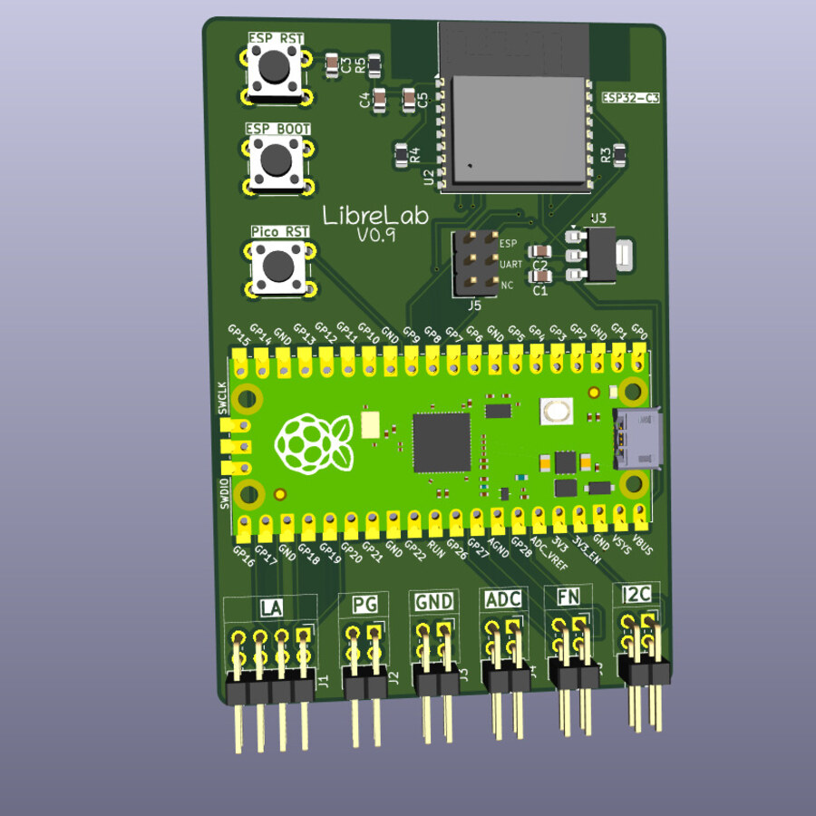
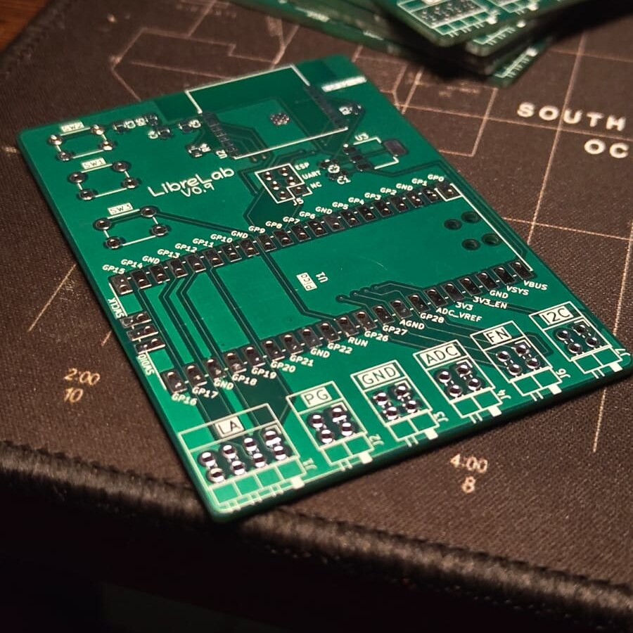
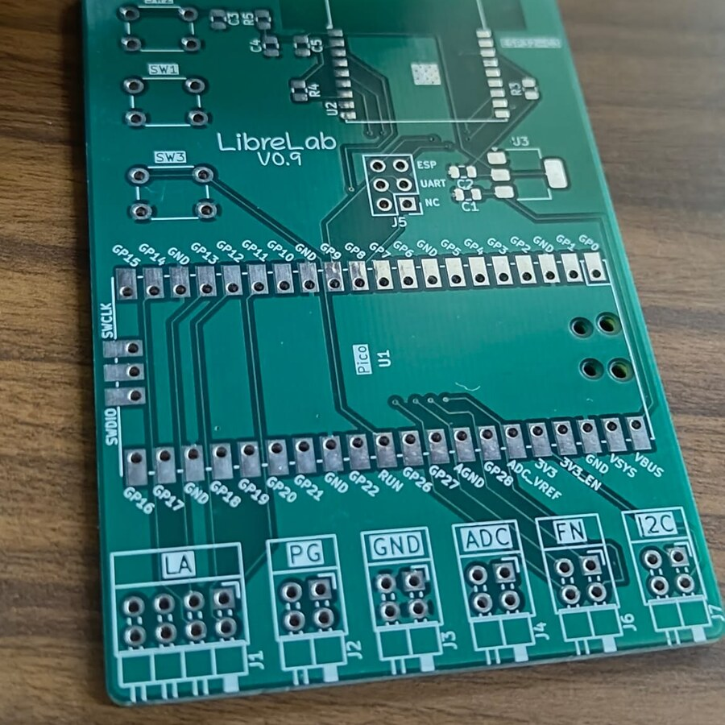

# LibreLab

LibreLab is a low-cost, open lab instrument for embedded developers: part logic analyser, part mixed-signal scope, part signal generator, part protocol workbench. The goal is simple: make the kind of debug workflow people buy premium USB instruments for available as open hardware and open software at student/hacker-lab pricing.

Current hardware is targeting a PCB+BOM cost below `₹2500`, roughly `$26.4` at recent INR/USD rates. The next hardware revision is targeting a sub-`$50` build with RP2350B, an AD9629-class high-speed ADC path, HSTX-based high-speed data movement toward a USB 3-class host link, and generous PSRAM buffering.

## Hardware Preview

<table>
  <tr>
    <td width="33%"></td>
    <td width="33%"></td>
    <td width="33%"></td>
  </tr>
  <tr>
    <td align="center">v0.9 board render</td>
    <td align="center">fabricated PCB stack</td>
    <td align="center">PCB top side</td>
  </tr>
</table>

## Software Preview


## Why This Is Interesting

Saleae's current Logic 8 is an 8-channel USB analyser rated at up to 100 MS/s digital capture, 10 MS/s analog capture, 10-bit analog resolution, long PC-streamed captures, 25+ protocol decoders, trigger/search, measurements, automation, and cross-platform software.[^saleae-product] [^saleae-specs]

LibreLab is aiming at that workflow from the other side of the cost curve:

- `150 MSPS` logic capture on the current RP2350 design path.
- `200 MSPS` logic capture under active development.
- `400 MSPS` burst-mode capture under active development.
- Logic analyser, oscilloscope, mixed-signal capture, pattern generation, test outputs, and bus gateways in one firmware stack.
- USB CDC SCPI today, with optional ESP32-C3 Wi-Fi bridge transport.
- First-party modern desktop software plus PulseView/libsigrok integration for people who prefer the classic sigrok workflow.
- Roadmap hardware aimed at high-speed analog capture and deeper buffering while staying below `$50`.

The bet is that a carefully designed RP2350-class instrument can be brutally useful for firmware bring-up, protocol debugging, education, and small-lab automation without needing a $500-class box on every desk.

## Current Firmware

The firmware lives in [firmware](firmware/) and currently targets Pico 2/RP2350A.

Implemented today:

- SCPI 1999-style command interface over USB CDC.
- 1-8 channel PIO/DMA logic analyser.
- One-channel RP2350 internal-ADC oscilloscope path.
- Synchronized mixed-signal one-shot capture.
- 1-8 channel digital pattern generator.
- UART and I2C bus gateways.
- SPI gateway code path, with a known bus-number mismatch still to fix.
- Square-wave and PWM-based analog test outputs.
- ESP32-C3 bridge firmware for TCP SCPI, UDP capture frames, SoftAP provisioning, and mDNS.
- Out-of-tree libsigrok/PulseView driver source.

Useful docs:

- [Firmware README](firmware/README.md)
- [Firmware architecture](firmware/docs/architecture.md)
- [SCPI command reference](firmware/docs/scpi-reference.md)
- [Hardware resources](firmware/docs/hardware.md)
- [RP2350B migration plan](firmware/docs/rp2350b-migration.md)

## Current Software

The desktop application lives in [software](software/) and is built with Electron, React, and TypeScript.

Implemented so far:

- Saleae-style capture workspace with channel rail, session tabs, timeline canvas, and right-side inspector.
- Logic, scope, and mixed-signal modes.
- Deterministic simulator device, so the GUI can be tested without hardware.
- Digital and analog waveform rendering with zoom, pan, fit, hover cursor, and A/B markers.
- Analyzer, measurement, output, and bus-console panels.
- Simulated I2C annotation lane using the same annotation model planned for libsigrokdecode.
- Unit, component, build, and GUI smoke tests.

More:

- [Software README](software/README.md)
- [Software architecture](software/docs/architecture.md)
- [Software feature map](software/docs/features.md)
- [Software testing](software/docs/testing.md)

Run it:

```bash
cd software
npm install
npm run dev
```

Run the browser-rendered GUI for quick UI work:

```bash
cd software
npm run dev:renderer -- --host 127.0.0.1
```

## Hardware Snapshot

The KiCad project lives in [pcb/librelab](pcb/librelab/). The current schematic/PCB includes:

- Raspberry Pi Pico module footprint.
- ESP32-C3-WROOM-02 wireless bridge module.
- AMS1117-3.3 regulator.
- Logic analyser headers.
- Pattern-generator headers.
- ADC headers.
- I2C headers.
- Function/test-output headers.
- Ground headers and reset/boot buttons.
- Generated fabrication outputs under `pcb/librelab/output/`.


## Roadmap

Near-term:

- Connect LibreLab Studio to the real USB SCPI firmware.
- Add capture import/export formats.
- Wire libsigrokdecode into a worker so GUI protocol annotations come from real decoders.
- Finish the SPI gateway bus-number fix.
- Keep PulseView support working alongside the first-party app.

Hardware vNext:

- RP2350B for a cleaner, conflict-free pin map.
- AD9629-class external ADC frontend for serious analog capture.
- HSTX-based high-speed data path toward USB 3-class streaming.
- PSRAM-backed captures and burst buffering.
- 200 MSPS sustained logic capture target and 400 MSPS burst experiments.
- Sub-`$50` target cost.

