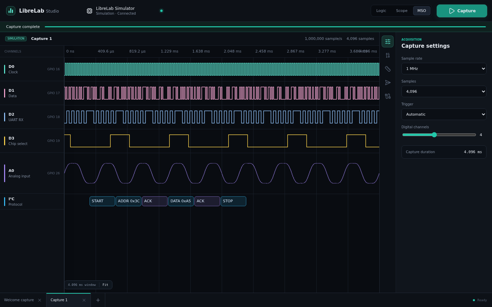
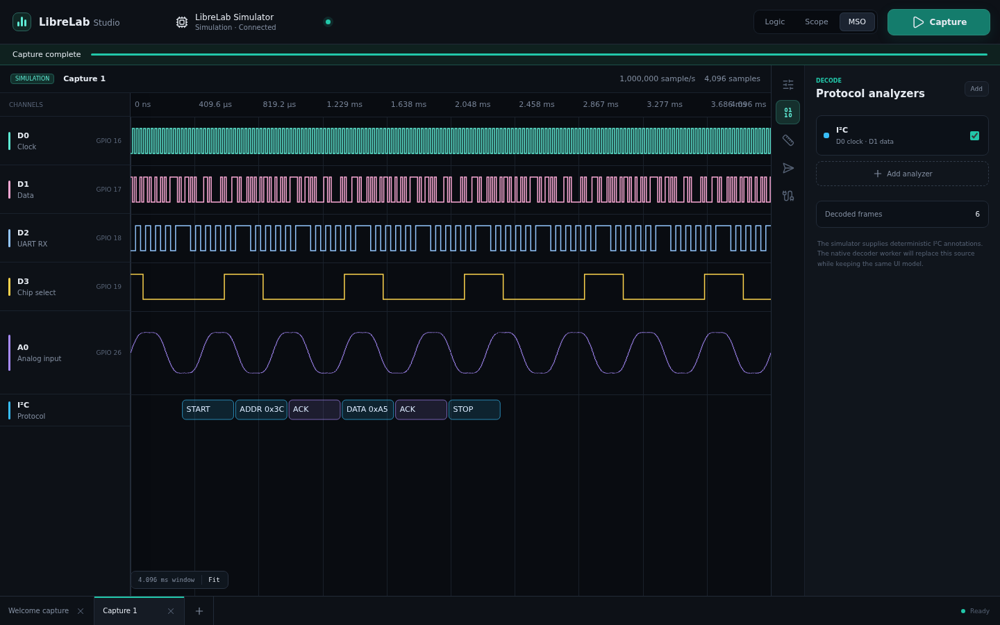
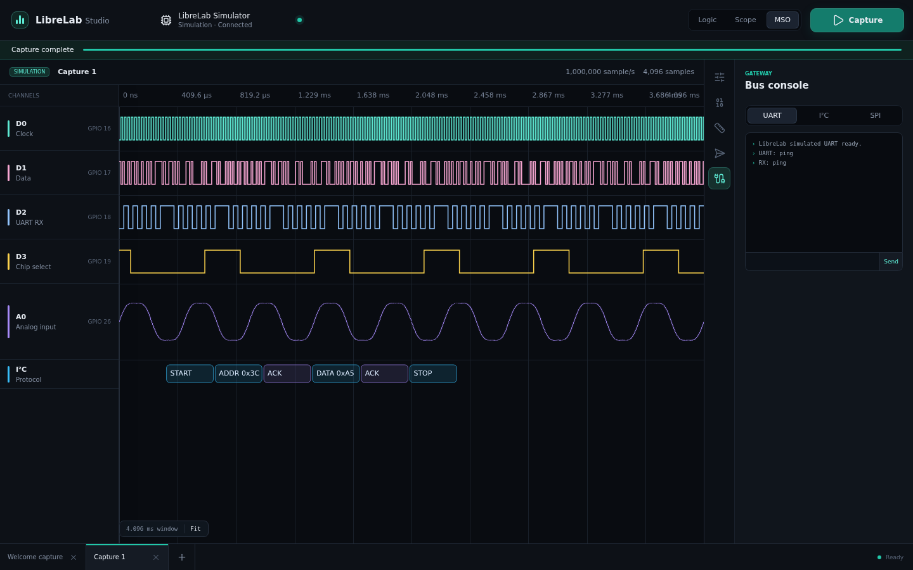

# LibreLab Studio

LibreLab Studio is the desktop control and analysis application for LibreLab instruments. The current implementation is an Electron, React, and TypeScript app with a Saleae-style capture workspace, a deterministic simulator, and automated tests that run without hardware.

This is the first vertical slice. It is designed so the UI, capture contract, renderer tests, and GUI smoke tests are usable now while the native hardware engine and libsigrokdecode bridge are added behind the same API.

## What Works Today

- Logic, oscilloscope, and mixed-signal workspace modes.
- Built-in LibreLab simulator exposed through the same API shape planned for hardware devices.
- Capture settings for sample rate, sample count, trigger mode, and digital channel count.
- Timeline viewport with digital traces, analog traces, zoom, pan, fit, hover cursor, and A/B marker measurement.
- I2C-style protocol annotations in the simulator.
- Analyzer, measurement, output, and bus-console side panels.
- Browser-side fallback simulator for component tests.
- GUI smoke test that captures data without hardware.

## Screenshots







## Commands

Run from this directory:

```bash
npm install
npm run dev
npm run typecheck
npm test
npm run test:e2e
npm run test:all
npm run docs:screenshots
npm run build
npm run package
```

`npm run dev` starts the Electron development app.

`npm run dev:renderer` starts only the renderer in a browser. This is useful for fast UI work and is the mode used by Playwright smoke tests.

`npm test` runs unit and component tests in jsdom.

`npm run test:e2e` builds the desktop app and runs the Playwright GUI smoke test against the renderer simulator in Chromium. On a fresh machine, install the Playwright browser once:

```bash
npx playwright install chromium
```

`npm run docs:screenshots` refreshes the screenshots in `docs/assets/`.

## Project Layout

```text
software/
  src/main/              Electron main process and device-service IPC
  src/preload/           Secure context bridge exposed as window.librelab
  src/renderer/src/      React app, waveform canvas, panels, styles
  src/shared/            Capture/device contracts and deterministic simulator
  tests/e2e/             Playwright GUI smoke tests
  docs/                  Architecture and testing notes
```

## Development Notes

The renderer never talks directly to Node, USB, or native libraries. It calls `window.librelab`, which is provided by the preload script in Electron and by a browser simulator in tests. That keeps the app secure and makes every GUI workflow testable without plugging in a board.

The future hardware path should implement the existing shared contracts first, then replace the mock device service with a native device engine. Protocol decoding should follow the same pattern: the UI consumes annotation records; a native worker can later fill those records from libsigrokdecode.
